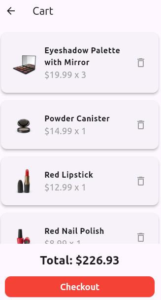

# Flutter E-commerce App

A Flutter application that displays a list of products with integrated search functionality. Users can search and view product details directly from the main screen add to cart and can look cart screen with detail cart information.

## Table of Contents

- [Flutter E-commerce App](#flutter-e-commerce-app)
  - [Table of Contents](#table-of-contents)
  - [Features](#features)
  - [Setup Instructions](#setup-instructions)
    - [Prerequisites](#prerequisites)
    - [Clone the Repository](#clone-the-repository)
    - [Install Dependencies](#install-dependencies)
    - [Configuration](#configuration)
    - [Run the App](#run-the-app)
    - [Running Tests](#running-tests)
  - [Dependencies](#dependencies)
  - [Dependency Versions](#dependency-versions)
  - [Contributing](#contributing)
  - [Smple screenshoots](#smple-screenshoots)

## Features

- Display a list of products.
- Search functionality with real-time filtering.
- Product details view on tap.
- Integration with a cart provider.

## Setup Instructions

### Prerequisites

- Flutter SDK (version 3.10.5 or higher)
- Dart SDK (included with Flutter)
- An IDE like Android Studio, IntelliJ IDEA, or VS Code with Flutter and Dart plugins installed.

### Clone the Repository

```bash
git clone https://github.com/Sireat/flutter_ecommerce.git
cd flutter_ecommerce
```

### Install Dependencies

Run the following command to install the required dependencies:

```bash
flutter pub get
```

### Configuration

Ensure you have a `ProductRepositoryImpl` class that fetches product data. Modify the implementation as needed to match your data source.

### Run the App

Use the following command to run the app on an emulator or a connected device:

```bash
flutter run
```

### Running Tests

To run tests, use:

```bash
flutter test
```

## Dependencies

Here are the dependencies used in this project:

- `flutter`: For Flutter SDK.
- `provider`: For state management.
- `http`: For making HTTP requests (if used).

These dependencies are specified in the `pubspec.yaml` file. Make sure to run `flutter pub get` to install them.

## Dependency Versions

```yaml
dependencies:
  flutter:
    sdk: flutter
  provider: ^7.1.3
  # Add other dependencies here

dev_dependencies:
  flutter_test:
    sdk: flutter
```

## Contributing

Contributions are welcome! Please follow these steps to contribute:

1. Fork the repository.
2. Create a new branch for your feature or bug fix.
3. Make your changes and commit them.
4. Push your changes to your forked repository.
5. Create a pull request to merge your changes into the main repository.

## Smple screenshoots





